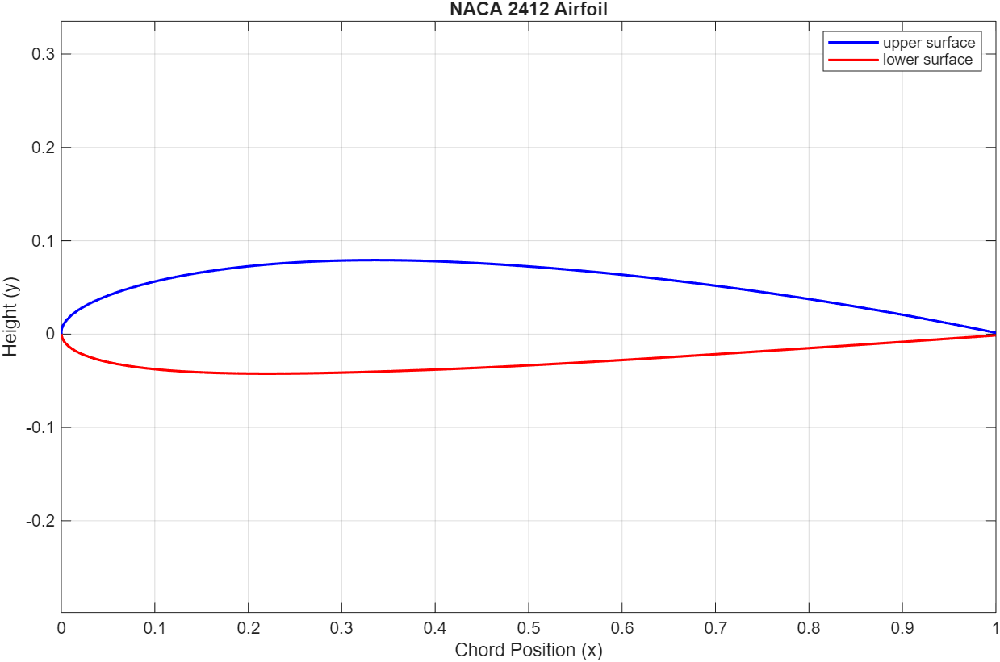
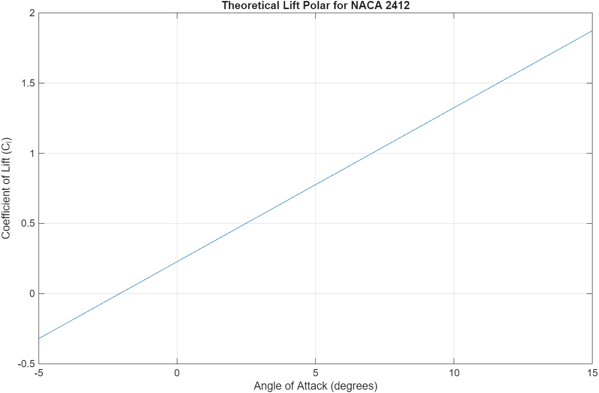

# Phase 1 learnings

**Objectives**: Parametric NACA 4-digit generator and thin airfoil theory baseline

Equations used:

- Camber line piecewise equations and slope derivatives ($\frac{dy_c}{dx}$).
- Surface offsets normal to camber: $\theta_c = \arctan(dy_c/dx)$.
- Glauert coordinate transformation: $x = \frac{c}{2}(1 - \cos\theta)$.

Key design decisions and trade offs:

- why cosine clustering?
  - for better resolution. Using linear spacing would result in the leading edge that looks jagged because less points are spaced
- why normal surface offsets?
  - the actual physical thickness becomes distorted if thickness was added vertically ($y_u = y_c + y_t$). The thickness **normal** to the mean camber line must be used i.e the curved surface must be used as well
- why numerical thin airfoil theory?
  - To generate $\alpha_{L=0}$ for an arbitary NACA 4 digit airfoil rather than using hardcoded values (good engineering practices)
- Why code rather than use tools like XLFR5 or airfoil plotting tools?
  - Can link to an optimizer and a standalone script can generate new coordinates on every iteration
  - Control of data, preventing translation errors when passoing data into CFD or FEA meshing scripts
  - Easy to debug if an imported geometry fails to mesh

## Results and visuals

